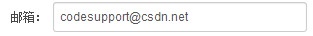

## 常见问题

----------
> 1 [为什么提交显示的作者不是我自己](#Q1)

----------
> 2 [查看文件及查看提交Diff的限制（zcw）](#Q2)

----------
> 3 [常见问题_3](#Q3)

----------
> 4 [常见问题_4](#Q4)

----------
> 5 [常见问题_5](#Q5)

----------

### [为什么提交显示的作者不是我自己](id:Q1)
出现这个问题的主要原因是本地Git环境下配置的用户邮箱不对

1. 首先检查账户设置 -> 个人信息 -> 邮箱的信息

1. 再检查本地Git环境下user.email配置

    $ git config user.email
    codesuport@csdn.net

1. 修改Git环境下user.email配置
`$ git config --global user.email "codesupport@csdn.net"`

### [查看文件及查看提交Diff的限制](id:Q2)

### [常见问题_3](id:Q3)

### [常见问题_4](id:Q4)

### [常见问题_5](id:Q5)

