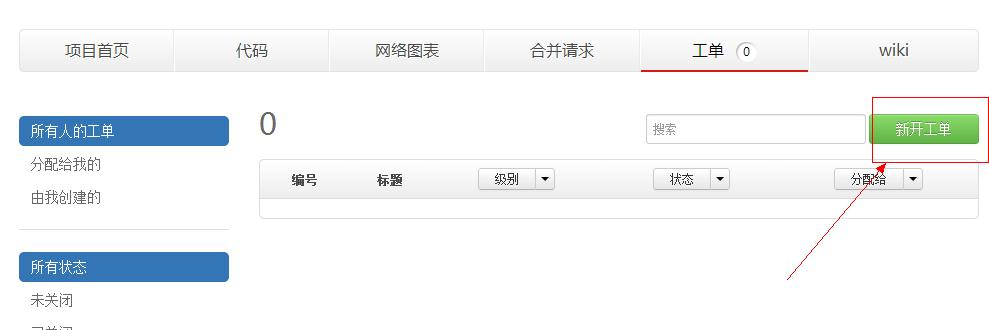
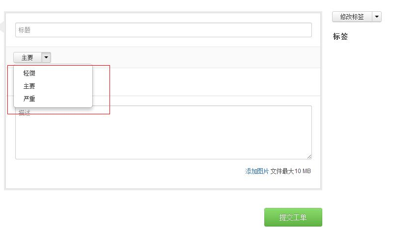
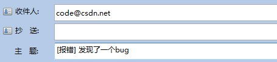

### 方法一：填写报错工单

在code首页导航栏点击“帮助”进入code平台帮助项目，点击“工单”——“新开工单”，在打开的页面编辑器里填入您想要提交的错误报告的名称、描述，并选择报告紧急程度“轻微、主要、严重”（默认为主要），完成后提交工单即可。

具体操作如图：

 
### 方法二：发送报错邮件

您也可以直接发送错误报告到code客服邮箱 <code@csdn.net>，在邮件标题中注明 **[报错]** 以便我们及时发现并处理。

