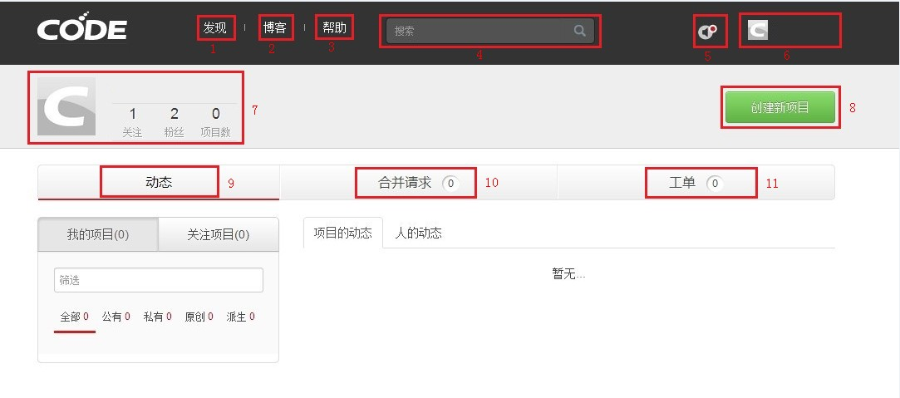
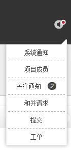

## 首页

**1.发现：**点击可以帮助用户查看到网站中项目、用户、编程语言的详细信息，也可根据不同条件进行排序查看。

**2.博客：**在此查看网站动态，行业相关信息、用户交流互动等。

**3.帮助：**如您在使用过程中有任何疑问，可在此进行查看。

**4.搜索：**在此输入您希望查找的用户或项目名称，可以找到相关结果。

**5.通知：**点击“通知”图标，可查看来自系统的各项通知。下拉菜单及内容如图所示。

**6.此处显示当前登陆用户名。**

**7.用户信息：**此处显示当前登陆用户关注数、粉丝数、项目数。

**8.创建新项目：**如您想创建一个新项目，点击此按钮。

**9.动态：**在此查看用户自己及所关注的项目及用户的信息。

**10.合并请求：**在此查看未处理合并信息及已处理合并信息的详细情况。

**11.工单：**在此进行bug提交、发起话题、讨论等带有互动性质的操作。

