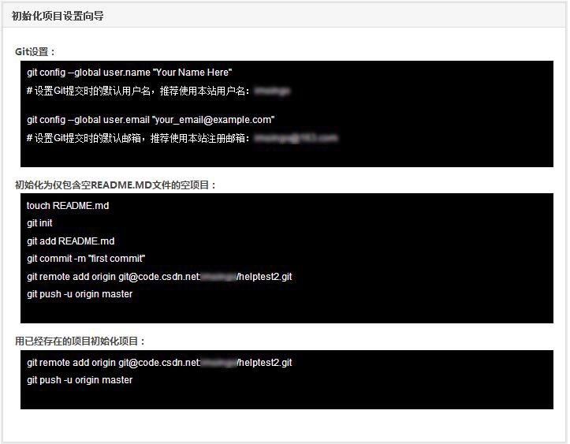

##创建一个新项目

登录code后在您的控制面板右上角，可以看到“创建新项目”的按钮，点击此按钮即可开始创建一个code项目。

在弹出的对话框中，按照提示填写项目名称、项目描述、项目主页等信息，点击创建即可生成一个新项目。

 
**需要注意的是：**

（1）**项目名称不允许使用中文**，只允许使用字母、数字、点、下划线和中划线

（2）项目描述将显示在项目名称下方，建议不要添加太多文字。更详细的项目介绍可使用wiki添加或者在README文件中介绍。

 

（3）如果您的项目有独立网站，请在“项目主页”处填写网站url，该地址将显示在您的项目名称的下方。没有可以不填写。

 
（4）您可以设定项目为公有或私有，其中公有项目为开源项目，任何人都可以查看和派生您的项目文件；私有项目不对外公开，但网站可能会对私有项目收取一定费用。[收费标准请见这里](https://github.com/hadesli/CodeFAQ/blob/master/FAQ_0_6.md "Code代码托管业务收费么?")

（5）默认使用README文件初始化项目。若您未勾选此项，将需要手动初始化。您可以在您的项目主页看到如下图所示的初始化向导，参照此向导在本地使用git命令初始化项目即可。

 
（6）创建项目时填写的所有内容均可在“[项目设置](https://github.com/hadesli/CodeFAQ/blob/master/FAQ_4_4.md "项目设置")”中修改。
