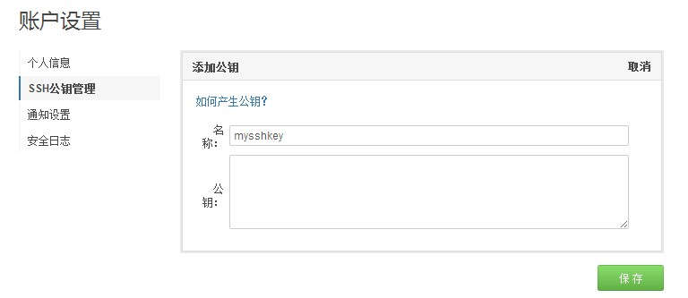

公钥是code识别您的用户身份的一种认证方式，通过公钥，您可以将本地git项目与code建立联系，然后您就可以很方便的将本地代码上传到code，或者将code代码下载到本地了。

### 1. 生成公钥

首先检查本机公钥：
`` $ cd ~/. ssh ``
 
如果提示：No such file or directory 说明你是第一次使用git。如果不是第一次使用，请执行下面的操作,清理原有ssh密钥。

``$ mkdir key_backup``

``$ cp id_rsa* key_backup``

``$ rm id_rsa*``

生成新的密钥：
``$ ssh-keygen –t rsa –C “您的邮箱地址” ``
 
在回车中会提示你输入一个密码，这个密码会在你提交项目时使用，如果为空的话提交项目时则不用输入。
 
您可以在你本机系统盘下，您的用户文件夹里发现一个.ssh文件，其中的id_rsa.pub文件里储存的即为刚刚生成的ssh密钥。

### 2. 添加公钥

登录code平台，进入用户“账户设置”，点击右侧栏的“ssh公钥管理”，点击“添加公钥”，将刚刚生成的公钥填写到“公钥”栏，并为它起一个名称，保存即可。

**注意**：复制公钥时不要复制多余的空格，否则可能添加不成功。

### 3. 管理公钥
您也可以在“账户设置”——“ssh公钥管理”删除或者修改公钥。