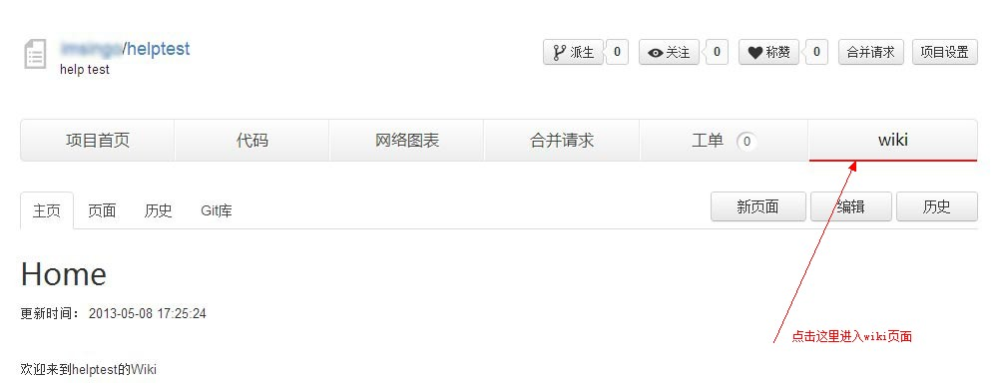
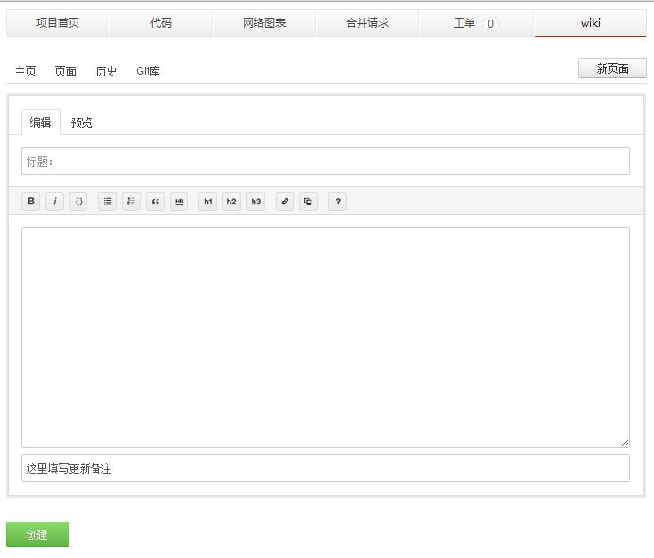
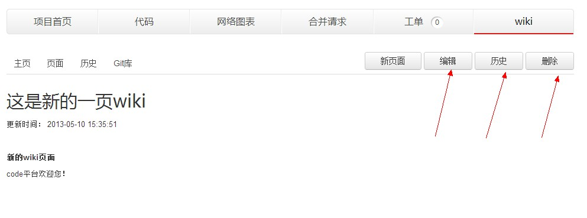
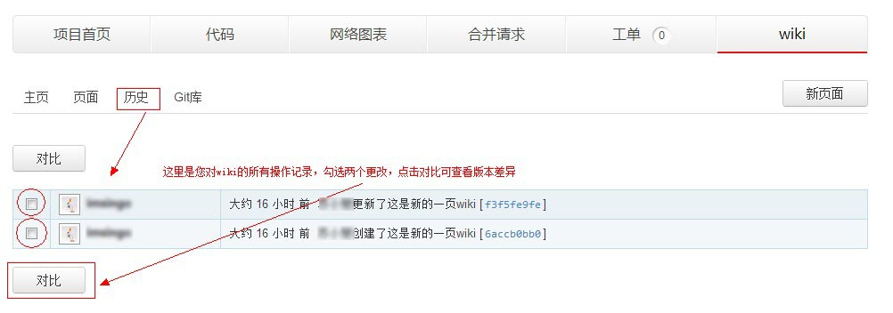
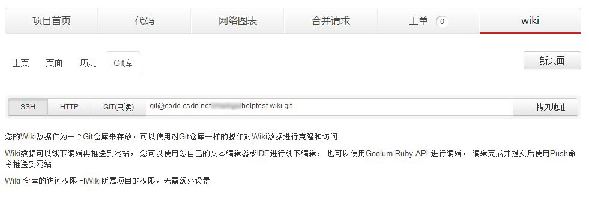

## wiki

wiki是一个项目的知识管理系统。一般来说，用于存放项目的介绍、用户手册、功能说明等内容。
### 1.进入wiki

在一个项目主页点击右上角的“wiki”标签，可以进入该项目的wiki页面。

 

### 2.编辑wiki

进入wiki页面默认展示的是主页内容。点击主页右上角的“编辑”按钮，可以重新编辑主页文字。

如果需要添加新的wiki页面，只需点击“新页面”按钮，即可新建一页wiki。 

Wiki支持markdown格式文本。您可以直接在编辑框内编写markdown代码，或者写好文字后使用编辑框上方提供的格式按钮排版。

编辑完成后，在正文下方的长方形文本框里填写本次编辑的备注，如果不填写，默认为“某某更新了新页”。

### 3.wiki页面

点击wiki页面左侧的“页面”标签，可以查看所有的wiki页面。

如果您需要对某个页面进行编辑、删除、查看历史版本等操作，需要点击进入该页面的详细页。

### 4.wiki历史

您对wiki的每次操作code都会记录在案。点击wiki页的“历史”标签，将可以看到所有的操作记录。包括创建页面、编辑页面，每次的编辑说明等。
 
选中其中的任意两个页面，点击“对比”按钮，可以查看每次编辑的变动。

### 4.wiki与git

每个项目的wiki数据作为一个git仓库来存放，因此，您可以像管理git项目库一样使用git命令对wiki数据进行克隆和访问。

Wiki数据可以线下编辑再推送到网站， 您可以使用您自己的文本编辑器或IDE进行线下编辑， 也可以使用Goolum Ruby API 进行编辑， 编辑完成并提交后使用Push命令推送到网站。

Wiki 仓库的访问权限同Wiki所属项目的权限，无需额外设置。

点击“git库”标签可以获取wiki的ssh、http、git地址。

