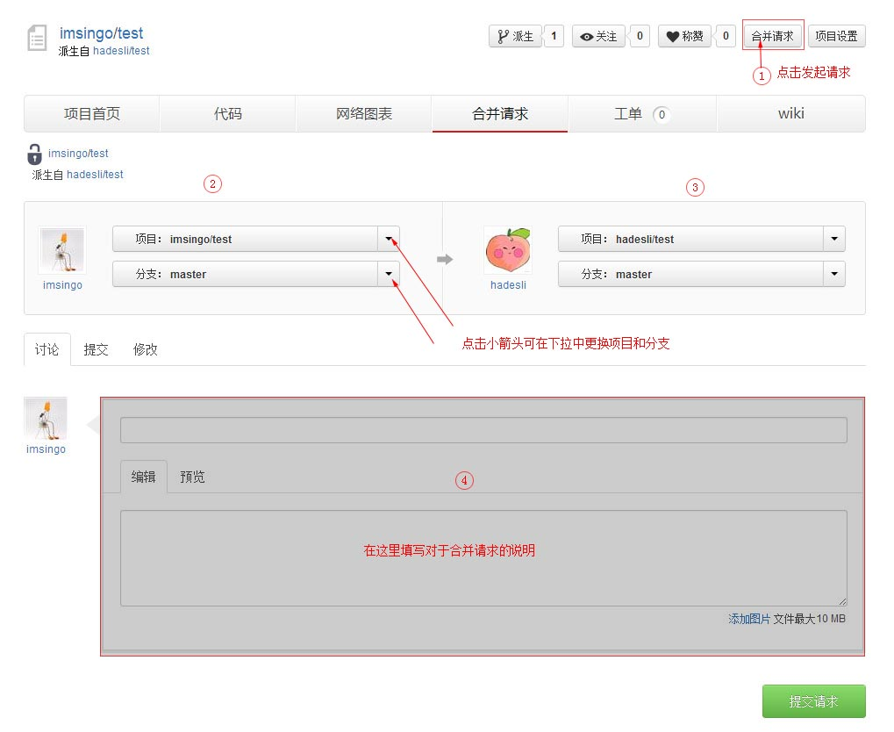
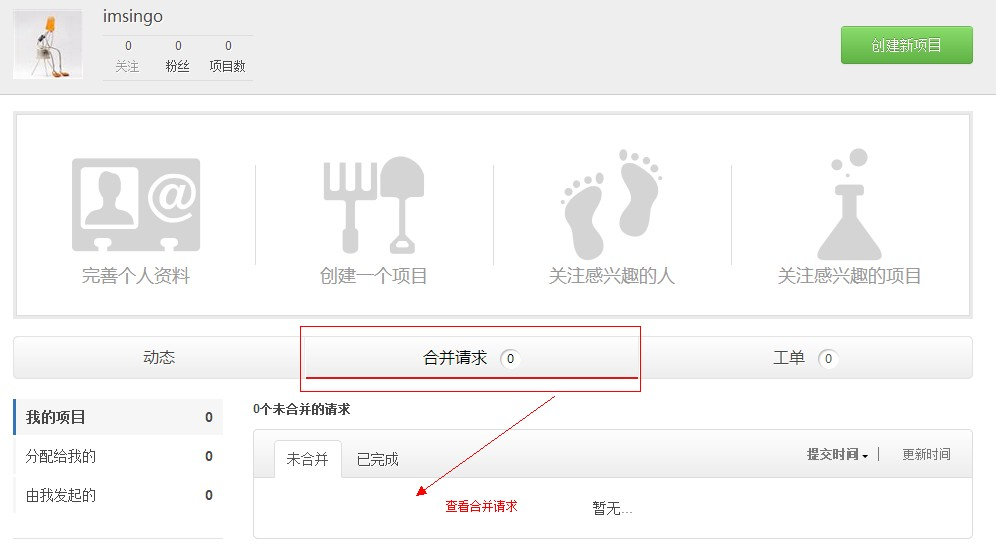

如果您希望您派生的项目的更改应用于主项目或者其他派生项目，您可以向对方发起 “合并请求”。

### 1.发起请求

在您自己的项目页，或者对方的项目页点击“合并请求”按钮，可以进入合并请求发起页。

### 2.选择项目和分支

在合并请求发起页面，您可以看到双方的用户名和项目信息。

其中，箭头左侧的是发起者也就是您的用户名称和项目信息（如上图区域 2），右侧是希望合并方的用户名和项目信息（如上图区域 3）。

点击项目名称及分支名称旁边的三角箭头，您可以在下拉列表中选择新的项目或分支。

### 3.填写合并请求说明

上图区域 4 部分，用于填写您对此次合并请求的说明。比如，修改了哪些地方，以及为何请求合并等。

点击“提交请求”按钮即可发送请求。

### 4.请求历史

上图区域 4 上方，点击“提交/修改”标签可以查看该项目的历史提交目录。

### 5.查看合并请求

查看别人向您发起的合并请求，您可以在自己的控制面板页面，点击“合并请求”按钮，进入合并请求列表页。

### 6.处理合并请求

[合并请求的处理方式请查看“项目管理——处理合并请求”](https://github.com/hadesli/CodeFAQ/blob/master/FAQ_4_2.md "处理合并请求")