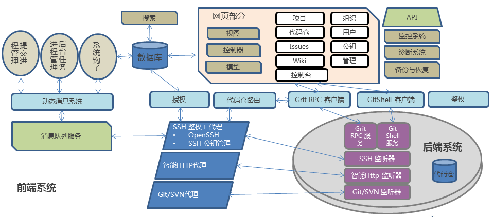

## 网站技术架构

- 使用阿里云作为底层平台
	- 弹性计算：当业务量超过系统设计容量后，可及时扩容
	- 数据备份：异地多处备份，保证数据安全
	- 系统保护及监控：云盾及云监控服务，全面保障系统运行

- 成熟的开源框架
	- 业内成熟的开源框架，如bootstrap，jquery，redis等
	- 在Gitlab基础上进行开发，实现了支持大用户量，社交编程等功能
	- 网站使用Ruby on Rails开发，后端系统服务大部分使用Go语言开发

**Code平台系统构架**

