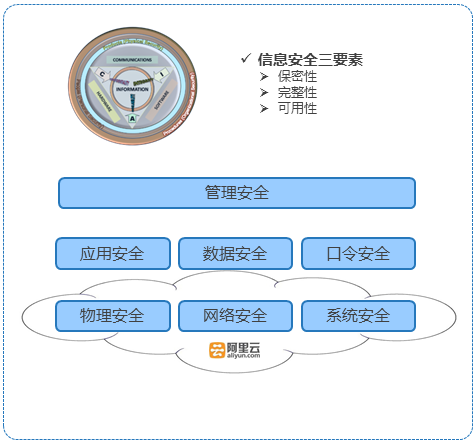

## 网站安全架构

- 管理安全
	- 安全管理操作策略及手册
	- 应急恢复策略
	- 日志审计

- 应用安全
	- 提供多种安全传输协议，保护用户个人信息
	- 各应用均进行特定的安全加固，防止应用出现安全漏洞
	- 实时应用服务状态监控，及时恢复应用支持

- 数据安全
	- 每日数据多份备份副本，损坏可短时间内快速恢复
	- 数据访问控制，各用户数据相互独立
	- 实时用户数据操作记录，各重要操作均有消息记录信息

- 口令安全
	- 统一的网站登录方式，存储及登录时均使用加密方式
	- 提供用户对SSH协议key的自行管理，使用更方便安全

- 系统安全
	- 持续端口入侵扫描，挂马扫描，漏洞扫描防护
	- 系统最新补丁持续及时更新，防止系统出现安全漏洞
	- 实时系统状态监控，有效防止过载及溢出错误

- 网络安全
	- 负载均衡及双机热备，持续提供网络服务
	- 网络防护设置，有效防护各类网络攻击
	- 实时网络状态监控，第一时间恢复各种网络故障

- 物理安全
	- 云平台的地理容灾机制
	- 阿里云保证机房的环境监控、访问策略等

**Code平台安全构架**

